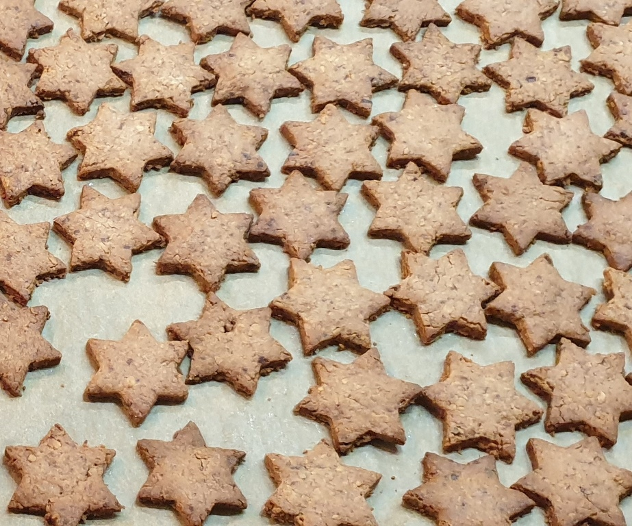

# Schoko-Kokos-Plätzchen

## Teig herstellen

* 50g Zartbitter-Schokolade
* 250g Mehl
* 1 Päckchen Vanillezucker
* 150g brauner Zucker
* 50g Kokosraspeln
* 1/2 Teelöffel Backpulver
* 6 Tropfen Butter-Vanille-Aroma

Die Zartbitter-Schokolade klein hacken.  Das Mehl mit dem Backpulver in die Schüssel sieben. Das vermeidet Klümpchenbildung und verteilt das Backpulver besser. Alle weiteren trockenen Zutaten dazutun und homogen in einer Schüssel vermischen.

* 1 Ei
* 125g Butter

Die Butter sollte nicht mehr ganz kalt sein, aber auch nicht zu weich. In kleine Flocken geschnitten in die trockene Mischung geben. Das Ei sollte ebenfalls nicht zu kalt sein. Wenn beides in der Schüssel ist dieses mit einem Rührgerät und Knethaken, später von Hand zu einem glatten Teig verkneten. Den Teigklumpen in Folie einwickeln und mind. 30 min im Kühlschrank kühlen.

**Hinweis:** der Teig lässt sich wunderbar vorbereiten und kann auch länger im Kühlschrank verweilen, bis man Zeit für das Formen und Backen hat.

## Plätzchen ausstechen

Den Teig auf einer bemehlten, glatten Unterlage nicht zu dick und nicht zu dünn ausrollen und dann nach Belieben mit Plätzchenformen ausstechen. Die Plätzchen auf das mit Backpapier bestückte Backblech auslegen.

Sollte der Teig beim ausrollen und Formen stechen zu "klebrig" werden, kann man den Teig im Kühlschrank nochmal nachkühlen.

## Backen

* Ofen vorheizen
* 160° Umluft oder 180° Ober-/Unterhitze
* pro Blech ca. 14 Minuten

Die Plätzchen zum Abkühlen auf ein Gitter legen. Wenn man möchte, kann man die Plätzchen noch mit Schokokuvertüre verzieren.

